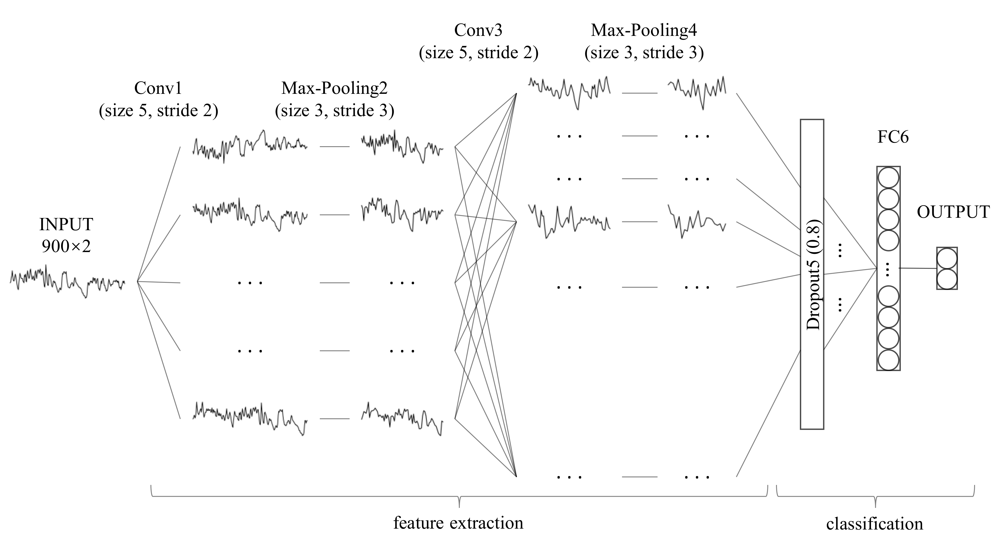

#  Code for: Sleep apnea detection from a single-lead ECG signal with automatic feature-extraction through a modified LeNet-5 convolutional neural network

## Abstract

Sleep apnea (SA) is the most common respiratory sleep disorder, leading to some serious neurological and cardiovascular diseases if left untreated. The diagnosis of SA is traditionally made using Polysomnography (PSG). However, this method requires many electrodes and wires, as well as an expert to monitor the test. Several researchers have proposed instead using a single channel signal for SA diagnosis. Among these options, the ECG signal is one of the most physiologically relevant signals of SA occurrence, and one that can be easily recorded using a wearable device. However, existing ECG signal-based methods mainly use features (i.e. frequency domain, time domain, and other nonlinear features) acquired from ECG and its derived signals in order to construct the model. This requires researchers to have rich experience in ECG, which is not common. A convolutional neural network (CNN) is a kind of deep neural network that can automatically learn effective feature representation from training data and has been successfully applied in many fields. Meanwhile, most studies have not considered the impact of adjacent segments on SA detection. Therefore, in this study, we propose a modified LeNet-5 convolutional neural network with adjacent segments for SA detection. Our experimental results show that our proposed method is useful for SA detection, and achieves better or comparable results when compared with traditional machine learning methods.

## Dataset

[apnea-ecg](https://physionet.org/content/apnea-ecg/1.0.0/), [event-1-answers](dataset/event-1-answers), [event-2-answers](dataset/event-2-answers)

## Usage

- Reproduce the results

> A pre-trained model is provided in the model directory. To reproduce our results, you should, first, download the Apnea-ecg database from the above link and save it in the dataset directory. Then, execute  `Preprocessing.py` to obtain the training and test dataset. After that, just run `Pre-training.py` and you will get the results of our paper.

- Re-train the model

> Just replace the last step of run `Pre-training.py` with `LeNet.py`.
>
> Noted that the optimization function of Keras and TensorFlow is slightly different in different versions. Therefore, to reproduce our results, it suggests that using the same version of Keras and TensorFlow as us, in our work the version of Keras is  2.3.1 and TensorFlow is 1.15.0. In addition, Keras and TensorFlow have a certain randomness, the actual results may be somewhat floating.  

## Requirements

Python==2.7
Keras==2.3
Tensorflow==2.1

## Cite

If our work is helpful to you, please cite:

Wang T, Lu C, Shen G, et al. Sleep apnea detection from a single-lead ECG signal with automatic feature-extraction through a modified LeNet-5 convolutional neural network[J]. PeerJ, 2019, 7: e7731. [https://doi.org/10.7717/peerj.7731](https://doi.org/10.7717/peerj.7731)

## Email:

If you have any questions, please email to: [wtustc@mail.ustc.edu.cn](mailto:wtustc@mail.ustc.edu.cn)
